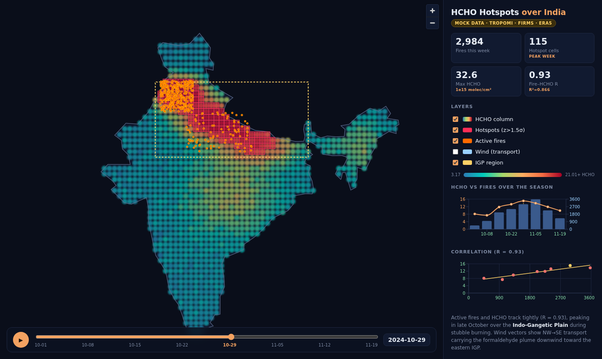

# HCHO Hotspots over India 🛰️🔥

ISRO BAH 2026 — Objective-2: identify spatio-temporal **HCHO (formaldehyde) hotspots**
over India from satellite data, tie them to **biomass burning**, and show **wind transport**.

Satellite data (TROPOMI HCHO · FIRMS fires · ERA5 wind) → statistical hotspot detection →
interactive map dashboard with a time slider over the 2024 crop-burning season.



## Architecture
```
data-pipeline/  Python — pulls + processes satellite data, writes JSON exports
   ├─ generate_mock_data.py   realistic MOCK data (works now, no account)
   └─ gee_pipeline.py         REAL Google Earth Engine pipeline (same output)
        ↓ writes backend/exports/*.json
backend/        FastAPI — serves the precomputed JSON  (you built this!)
        ↓ HTTP /api/*
frontend/       React + Vite + MapLibre + Recharts dashboard
```
The dashboard reads **precomputed static JSON**, so the demo never depends on a live
Earth Engine call. Mock ↔ real data is a one-command swap (re-run the pipeline).

## Run it (3 terminals)

**1. Generate data** (once):
```bash
backend/.venv/bin/python data-pipeline/generate_mock_data.py
backend/.venv/bin/python data-pipeline/gen_wind_textures.py   # bakes U/V wind PNGs for the GPU particle layer
```

**2. Backend:**
```bash
cd backend
source .venv/bin/activate
uvicorn main:app --reload          # http://127.0.0.1:8000  (docs at /docs)
```

**3. Frontend:**
```bash
cd frontend
npm install                        # first time only
npm run dev                        # http://localhost:5173
```

## Swap in REAL satellite data
One command. Hotspot detection (Getis-Ord Gi*), region naming and the overlay
bakes are shared with the mock pipeline (`pipeline_common.py`), so the output
schema is identical — the dashboard can't tell mock from real.
```bash
cd data-pipeline
pip install -r requirements-gee.txt
earthengine authenticate
export EE_PROJECT=your-gee-project-id
python gee_pipeline.py             # refreshes data + bakes overlays — UI unchanged
```
The official boundary files (`india.geojson`, `india_states.geojson`) are static
and shared, so they are **not** overwritten by the swap.

## How it maps to the PS (Objective-2)
| Official step | Where |
|---|---|
| 1 Acquire & pre-process HCHO | `hcho_grid.json` (TROPOMI) |
| 2 Extract burning periods (fires) | `fires.json` (FIRMS) + time-series |
| 3 Map spatio-temporal HCHO | map + time slider |
| 4 Identify hotspots (statistical) | z-score > mean+1.5σ → `hotspots.json` |
| 5 Fire ↔ HCHO correlation | scatter + Pearson R = 0.93 |
| 6 Transport via wind | ERA5 wind arrows (NW→SE) |

See [ROADMAP.md](ROADMAP.md) for the full plan, team split, and demo narrative.
